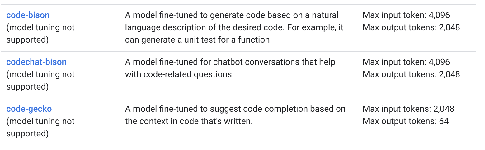

# Text-to-SQL demo using Vertex AI's Codey APIs. 
The Vertex AI PaLM API contains the publisher endpoints for Google's Pathways Language Model 2 (PaLM 2), which are large language models (LLMs) that generate text and code in response to natural language prompts. The Codey APIs include three models that generate code, suggest code for code completion, and let developers chat to get help with code-related questions.

## Setup
Create a config.py in the config folder with the following environment variables.
openai_api_key = "" API key from OpenAI
service_account = "" #Cloud SQL service account
database_version="MYSQL_8_0" 
cpu=2
memory="8GB"
storage_size="10GB"
db_user = ""
db_name = ""
bucket = "gs://" # bucket for storing MySQL dump file
project_id=""
region=""
instance_name="" # Instance name

## Section 1: Loading example dataset into database - mysql-database-setup.ipynb
1. Download MySQL dump file from [MySQL Public Tutorial](https://www.mysqltutorial.org/mysql-sample-database.aspx)
2. Create Cloud Storage bucket and Cloud SQL MySQL instance
3. Import MySQL dump file into Cloud SQL instance

### Database Schema
This is a very common example relational structure for a retail company


## Section 2: Use Text-to-SQL Generative AI to get questions/answers from our database.
Vertex AI includes a suite of models that work with code. Together these code models are referred to as the Vertex AI Codey APIs. The Vertex AI Codey APIs include the following:

* The **code generation** API - Generates code based on a natural language description of the desired code. For example, it can generate a unit test for a function. The code generation API supports the ```code-bison``` model. For more information about the ```code-bison``` model, see [Code generation model parameters](https://cloud.google.com/vertex-ai/docs/generative-ai/learn/models#code-generation-prompt-parameters).

* The **code chat** API - Can power a chatbot that assists with code-related questions. For example, you can use it for help debugging code. The code chat API supports the ```codechat-bison``` model. For more information about the ```codechat-bison``` model, see [Code chat model parameters](https://cloud.google.com/vertex-ai/docs/generative-ai/learn/models#code-chat-prompt-parameters).

* The **code completion** API - Provides code autocompletion suggestions as you write code. The API uses the context of the code you're writing to make its suggestions. The code completion API supports the ```code-gecko``` model. Use the ```code-gecko``` model to help improve the speed and accuracy of writing code. For more information about the ```code-gecko``` model, see [Code completion model parameters](https://cloud.google.com/vertex-ai/docs/generative-ai/learn/models#code-completion-prompt-parameters).




## Section 3 (**BONUS**): Let's interact with the Code Chat API to see if it can generate questions for us.
* This could be useful for generating a lot of questions/answers about the database and creating embeddings of the questions. A vector database like Vertex Matching Engine could store the question embeddings for future similarity matching and query retrieval/execution.
* Additionally, while fine-tuning code-bison is not possible today it is in the roadmap and this workflow could be used to generate lots of example question/answers.